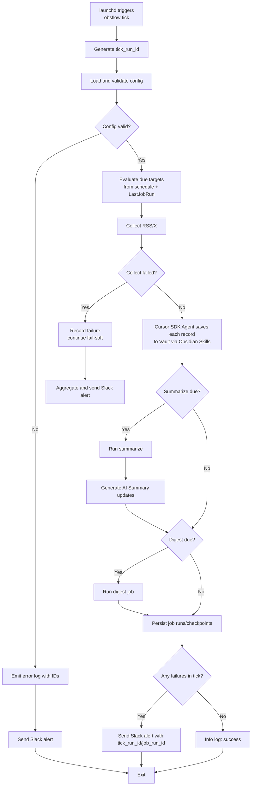

# 個人向け情報収集・要約パイプライン: 詳細設計

最終更新: 2026-05-05

## 1. 目的

`ARCHITECTURE_OVERVIEW.md` で合意した全体構成を、TypeScript 実装可能な粒度まで具体化する。

本ドキュメントは、個人開発で運用し続けられるシンプルさを優先する。

## 2. 設計原則

1. 単一実行入口を基本とし、定期実行は `obsflow tick` を中心に運用する。
2. `obsflow run` と `obsflow validate` は手動補助コマンドとして扱う。
3. レコード粒度は 1 ソース = 1 レコードを維持する。
4. Vault 更新は Cursor SDK エージェント + Obsidian Skills 経由で行う。
5. 外部依存は provider で抽象化し、初期は mock を標準にする。
6. 状態管理は interface で抽象化し、SQLite 以外のストアへ将来差し替え可能にする。

## 3. 技術スタック

- 言語: TypeScript
- 実行環境: Node.js 24+（`package.json` の `engines` に準拠）
- エージェント実行: `@cursor/sdk`
- CLI: `commander` (または同等の標準的 CLI ライブラリ)
- 設定ファイル: YAML (`yaml`)
- 定期実行: macOS launchd
- 初期状態ストア: SQLite (`better-sqlite3` または同等)
- ログ: JSON 構造化ログ (`pino` または同等)
- 通知: Slack Incoming Webhook
- RSS クライアント (real provider): `feedsmith`
- X SDK (real provider): `@xdevplatform/xdk`

### 3.1 外部依存の provider 方針

- RSS は `provider: mock|feedsmith` の切替を持つ。
- X は `provider: mock|x-sdk` の切替を持つ。
- AI は `provider: mock|real` の切替を持つ。
- Alert は `provider: mock|slack` の切替を持つ。
- 開発初期は `mock` をデフォルトとし、`real` は後から有効化できる構成にする。
- X mock のレスポンス形は X API ドキュメント (`https://docs.x.com/x-api/overview`) の基本構造に寄せる。

## 4. ディレクトリ構成

個人開発の保守性を重視し、TypeScript 向けに浅い構成を採用する。

```text
src/
  main.ts
  cli.ts
  config.ts
  types.ts
  orchestrator.ts
  jobs/
    collect.ts
    summarize.ts
    digest.ts
  adapters/
    interfaces.ts
    state-sqlite.ts
    feedsmith.ts
    x-sdk.ts
    x-mock.ts
    ai-mock.ts
    ai-real.ts
    vault-agent.ts
    alert-slack.ts
    alert-mock.ts
  agent.ts
  logger.ts
test/
  fixtures/
```

## 5. レイヤー責務

### 5.1 handler 層
- CLI の引数解釈と入出力制御を担当。
- ビジネスロジックは持たず、service 層を呼ぶ。

### 5.2 service 層
- ユースケース単位の処理フローを担当。
- repository interface に依存し、実装詳細には依存しない。

### 5.3 repository 層
- 外部 I/O を担当 (X SDK、RSS、Vault、AI、Slack、状態 DB)。
- 永続化や API 呼び出しをカプセル化する。

## 6. CLI 仕様

### 6.1 コマンド名と構成

- 実行ファイル名は `obsflow` とする。
- `pipeline` は汎用名で衝突や誤認が起きやすいため利用しない。

コマンド構成:

- `obsflow tick --config <path>`
  - 定期実行用の主コマンド。設定に基づいて実行対象を判定する。
- `obsflow run --config <path> --targets <csv>`
  - 手動実行用。`targets` で明示した処理のみ実行する。
- `obsflow validate --config <path>`
  - 設定ファイル検証のみを行う。

`tick` はサブコマンド名であり、オプションではない。

### 6.2 `targets` の値

`run` で指定可能なターゲット:

- `collect-rss`
- `collect-x-search`
- `collect-x-lists`
- `collect-x-bookmarks`
- `summarize`
- `digest-daily`
- `digest-weekly`
- `digest-monthly`
- `digest-quarterly`
- `digest-semiannual` (半期)
- `digest-annually`
- `digest-all` (有効なすべての digest cadence を実行)

### 6.3 終了コード

- `0`: 正常終了
- `1`: 設定・入力エラー
- `2`: 外部依存エラー (API/ネットワーク/DB)
- `3`: 処理失敗 (一部または全体)

fail-soft 実行で複数種別の失敗が混在した場合は、優先度 `1 > 2 > 3` で最上位を返す。

## 7. 設定ファイル仕様 (YAML)

k8s/dbt のように、上位に `version`、中位に `defaults`、下位に宣言配列を持つ形を採用する。

### 7.1 重要ポリシー

- 認証情報そのものは設定ファイルへ書かない。
- 認証情報は 1Password CLI (`op`) で取得し、起動前に環境変数へ注入する。
- 設定ファイルには `*_env` 形式で環境変数名のみを記載する。
- `obsflow validate` は必須の `*_env` キーと実環境の変数存在を検証する。

### 7.2 設定例

```yaml
version: 1
timezone: "Asia/Tokyo"

defaults:
  vault_path: "/Users/you/ObsidianVault"
  state:
    driver: "sqlite"
    dsn: "./state.db"
  auth:
    x_bearer_token_env: "X_BEARER_TOKEN"
    ai_api_key_env: "AI_API_KEY"
  alert:
    slack_webhook_env: "SLACK_WEBHOOK_URL"

sources:
  rss:
    - id: "hn"
      enabled: true
      url: "https://news.ycombinator.com/rss"
      schedule: "*/30 * * * *"

  x:
    provider: "mock" # mock|x-sdk
    search:
      - id: "ai-search"
        enabled: true
        query: "(llm OR agent) lang:ja -is:retweet -is:reply"
        schedule: "*/15 * * * *"
    lists:
      - id: "trusted-list"
        enabled: true
        list_id: "1234567890"
        schedule: "*/20 * * * *"
    bookmarks:
      - id: "my-bookmarks"
        enabled: true
        schedule: "0 * * * *"

ai:
  provider: "mock" # mock|real

jobs:
  - id: "summarize-main"
    type: "summarize"
    enabled: true
    schedule: "*/15 * * * *"

  - id: "digest-daily"
    type: "digest"
    cadence: "daily"
    enabled: true
    schedule: "0 22 * * *"

  - id: "digest-weekly"
    type: "digest"
    cadence: "weekly"
    enabled: true
    schedule: "0 21 * * 0"

  - id: "digest-monthly"
    type: "digest"
    cadence: "monthly"
    enabled: true
    schedule: "0 21 1 * *"

  - id: "digest-quarterly"
    type: "digest"
    cadence: "quarterly"
    enabled: true
    schedule: "0 21 1 */3 *"

  - id: "digest-semiannual"
    type: "digest"
    cadence: "semiannual"
    enabled: true
    schedule: "0 21 1 1,7 *"

  - id: "digest-annually"
    type: "digest"
    cadence: "annually"
    enabled: true
    schedule: "0 21 1 1 *"
```

`digest` で利用する `cadence` の許容値:

- `daily`
- `weekly`
- `monthly`
- `quarterly`
- `semiannual` (半期)
- `annually`

1Password CLI を使った実行例:

```bash
eval "$(op signin)"
export X_BEARER_TOKEN="$(op read 'op://Private/obsflow/X_BEARER_TOKEN')"
export AI_API_KEY="$(op read 'op://Private/obsflow/AI_API_KEY')"
export SLACK_WEBHOOK_URL="$(op read 'op://Private/obsflow/SLACK_WEBHOOK_URL')"
obsflow tick --config ./config.yaml
```

## 8. 実行シーケンスとスケジュール判定

`tick` 実行時の標準フロー:

1. `tick_run_id` を生成する (`crypto.randomUUID()`)。
2. 設定読込・検証。
3. `launchd` の起動時刻を基準に、各 `schedule` の due 判定を実施。
4. source 収集 (RSS/X) を順次実行し、Vault へ 1 レコード単位で Cursor SDK + Obsidian Skills を使って保存する。
5. due の summarize ジョブを実行し、AI Summary の更新内容を生成する。
6. due の digest ジョブを実行。
7. 失敗があれば Alert で Slack 通知。

失敗が発生しても、他ターゲットが実行可能なら継続する (fail-soft)。

### 8.1 launchd と cron の関係

- launchd は最小スケジュール粒度より短い間隔で `obsflow tick` を起動する (例: 5 分間隔)。
- `tick` が `LastJobRun` と現在時刻から「今回実行すべき対象」を判定する。
- スリープ復帰後は catch-up 判定を行い、未実行スロットを 1 回分実行する。

### 8.2 フローチャート



## 9. Vault 更新仕様

### 9.1 ノート作成

- 保存先は source 種別ごとの固定ディレクトリ配下とする。
- 1 ソース = 1 ノートで作成し、source item key を frontmatter に保持する。

### 9.2 AI 要約追記/更新

- summarize 対象ノートに `## AI Summary` セクションを持たせる。
- セクションが未作成なら追加、既存なら同セクションのみ置換更新する。
- raw 本文セクションは上書きしない。
- 実際の編集は Obsidian Skills を前提とした Cursor SDK エージェントに委譲する。

## 10. 状態管理設計

状態管理は以下のために必須:

- 増分取得 (X の since_id、RSS の取得境界)
- 重複防止
- 失敗復旧
- 定期処理の整合

### 10.1 repository interface (TypeScript)

```ts
export interface StateRepository {
  getCheckpoint(sourceId: string): Promise<Checkpoint | null>;
  putCheckpoint(cp: Checkpoint): Promise<void>;

  seenSourceItem(sourceId: string, itemKey: string): Promise<boolean>;
  markSourceItemSeen(
    sourceId: string,
    itemKey: string,
    contentHash: string,
  ): Promise<void>;

  seenContentHash(sourceId: string, contentHash: string): Promise<boolean>;

  lastJobRun(jobId: string): Promise<JobRun | null>;
  saveJobRun(run: JobRun): Promise<void>;

  inTx<T>(fn: (tx: StateTx) => Promise<T>): Promise<T>;
  close(): Promise<void>;
}
```

### 10.2 transaction 境界

- 単一 source の 1 アイテム処理 (`markSourceItemSeen` + `putCheckpoint`) は同一トランザクションで commit する。
- これにより、途中失敗時の checkpoint/既読状態の不整合を防ぐ。

### 10.3 key/hash 生成規則

- X:
  - source item key: post ID
  - content hash: 正規化済み本文 + 展開 URL + author ID
- RSS:
  - source item key: `guid` 優先、なければ `link`、最後に `title + published_at`
  - content hash: 正規化済み title + summary/content + canonical URL

### 10.4 状態データの ID 方針

- 状態管理データには ID を付与する。
- 新規 ID 生成は `crypto.randomUUID()` を利用する。
- 最低限、以下の ID を扱う:
  - `tick_run_id`: `obsflow tick` 1 回の実行単位 ID
  - `job_run_id`: 各ジョブ実行単位 ID
- `job_runs` には `job_run_id` と `tick_run_id` の両方を保存し、親子関係を追跡可能にする。

## 11. エラー通知とリトライ

- 通知トリガー: 例外または非ゼロ終了相当の失敗
- 通知先: Slack Webhook
- 通知粒度: 失敗の都度
- 同一 tick 内で同一原因の失敗が重複した場合は 1 通に集約する

通知内容 (最小):
- timestamp
- target/source id
- error summary
- `tick_run_id`
- `job_run_id` (該当時)

リトライ方針:
- 同一 tick 内では自動リトライしない (処理を単純化する)。
- 再試行は次回 tick に委譲する。

## 12. ローカル運用 (launchd)

- launchd は一定間隔で `obsflow tick --config ...` を呼ぶ。
- 推奨間隔は 5 分 (最短 schedule の上限に合わせて調整)。
- ログは JSON 1 行形式を標準出力/標準エラーへ出し、launchd 側でファイル化する。
- すべてのログイベントに `tick_run_id` を含める。
- ジョブ単位ログには `job_run_id`, `job_id`, `source_id` (該当時) を追加する。

## 13. 非ゴール / 将来拡張

本フェーズで扱わない事項:

- frontmatter の詳細項目定義
- トピック分類ルール詳細
- モデル評価・比較

将来拡張:

- GitHub Actions での同一実行フロー運用
- 状態ストアを非ローカル DB へ置換
- 通知チャネル追加 (メールなど)
